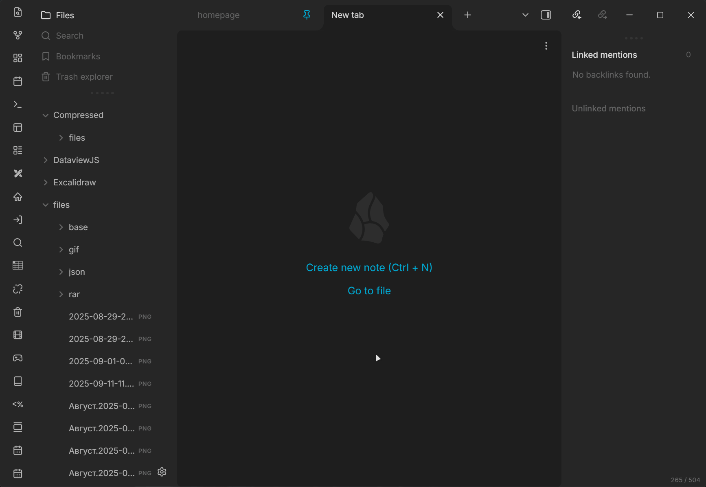

# Local Image Compress

Kompresuj pliki PNG i JPEG bezpośrednio w magazynie Obsidian na swoim komputerze, bez usług chmurowych i API. Zmniejsz miejsce zajmowane przez obrazy o 30–70% bez utraty jakości.

Read in your language: [English](../README.md) • [العربية](README.ar.md) • [Deutsch](README.de.md) • [Español](README.es.md) • [فارسی](README.fa.md) • [Français](README.fr.md) • [Bahasa Indonesia](README.id.md) • [Italiano](README.it.md) • [Nederlands](README.nl.md) • [Polski](README.pl.md) • [Português](README.pt.md) • [Português (Brasil)](README.pt-br.md) • [Русский](README.ru.md) • [ไทย](README.th.md) • [Türkçe](README.tr.md) • [Українська](README.uk.md) • [Tiếng Việt](README.vi.md) • [日本語](README.ja.md) • [한국어](README.ko.md) • [中文简体](README.zh-cn.md) • [中文繁體](README.zh-tw.md)

### Spis treści
- [Funkcje](#funkcje)
- [Obsługiwane formaty](#obsługiwane-formaty)
- [Ustawienia](#ustawienia)
- [Jak to działa](#jak-to-działa)
- [Przechowywanie danych i kopie zapasowe](#przechowywanie-danych-i-kopie-zapasowe)
- [Automatyzacja](#automatyzacja)
- [Współpraca z Paste Image Rename](#współpraca-z-paste-image-rename)
- [Prywatność i zachowanie zewnętrzne](#prywatność-i-zachowanie-zewnętrzne)
- [Wskazówki](#wskazówki)
- [Częste pytania](#częste-pytania)
- [Licencja](#licencja)

### Funkcje
- **Kompresja lokalna**: obrazy PNG i JPEG są kompresowane lokalnie.
- **Polecenia**:
  - **Kompresuj wszystkie obrazy w notatce**: przetwarza obrazy używane lub przywołane w aktywnej notatce.
  - **Kompresuj wszystkie obrazy w folderze**: pozwala wybrać folder i kompresuje wszystkie obsługiwane obrazy poza folderem wyjściowym.
  - **Kompresuj wszystkie obrazy w magazynie**: skanuje cały magazyn poza folderem wyjściowym.
  - **Przenieś skompresowane pliki**: przenosi wyniki do lokalizacji oryginałów. Wcześniej tworzy kopię wersji oryginalnej i skompresowanej.
- **Automatyzacja**:
  - Automatycznie kompresuj nowe pliki po dodaniu
  - Kompresuj w tle po bezczynności, gdy liczba nieskompresowanych obrazów osiągnie próg
- **Interfejs i wygoda**:
  - Menu kontekstowe plików i folderów
  - Wskaźnik oszczędzonego miejsca ze szczegółową podpowiedzią
  - Wskaźnik postępu na pasku stanu
- **Bezpieczeństwo i niezawodność**:
  - Pamięć podręczna przetworzonych plików z kopiami
  - Kopie zapasowe przed przeniesieniem skompresowanych plików, z automatycznym usuwaniem

### Obsługiwane formaty
- PNG (potok WASM `imagequant`)
- JPEG/JPG (potok WASM `mozjpeg`)

WebP, GIF, BMP, HEIC/HEIF i AVIF są celowo pomijane w tej wersji, ponieważ wtyczka nie zawiera ich koderów.

### Ustawienia

| Ustawienie | Opis | Typ/zakres | Domyślnie |
|---|---|---|---|
| Jakość PNG (min-maks) | Zakres jakości stratnej kwantyzacji PNG | 1-100 (np. `65-80`) | `65-80` |
| Jakość JPEG | Jakość kompresji JPEG | 1-95 | `85` |
| Dozwolone katalogi główne | Ścieżki względne, w których można kompresować. Puste = cały magazyn | lista ciągów | puste |
| Folder wyjściowy | Folder zapisu skompresowanych plików | ciąg | `Compressed` |
| Automatycznie kompresuj nowe pliki | Kompresuj nowe obrazy po dodaniu | wartość logiczna | `false` |
| Kompresja w tle | Kompresuj w tle podczas bezczynności | wartość logiczna | `true` |
| Próg kompresji w tle | Liczba nieskompresowanych obrazów wymagana do automatycznego startu | 10-1000 | `50` |
| Próg bezczynności | Minuty bez aktywności przed rozpoczęciem kompresji w tle | 1-60 minut | `2` |
| Automatyczna retencja kopii | Automatycznie usuń stare kopie sprzed przeniesienia | wartość logiczna | `false` |
| Przechowuj kopie, dni | Usuń kopie przenoszenia starsze niż N dni, gdy retencja jest włączona | 1-365 | `30` |
| Automatycznie przenoś skompresowane pliki | Przy starcie przenieś pliki do lokalizacji oryginałów i zastąp je | wartość logiczna | `false` |
| Próg automatycznego przenoszenia | Liczba gotowych plików uruchamiająca automatyczne przenoszenie | 1-1000 | `50` |

### Jak to działa
1. Skompresowane pliki są zapisywane w `Compressed` z zachowaniem pierwotnej struktury ścieżek.
2. Pamięć podręczna zapisuje przetworzone pliki i ich pierwotne rozmiary, aby zapobiec ponownej kompresji i poprawnie obliczać oszczędność.
3. „Przenieś skompresowane pliki” przenosi pliki z `Compressed` do pierwotnych lokalizacji, jeśli oryginał znajduje się w dozwolonym katalogu. Wcześniej tworzona jest kopia.

Bardzo małe pliki są zwykle pomijane (`<5KB` dla PNG i `<10KB` dla JPEG).

Wewnętrzne limity bezpieczeństwa są stałe: pliki większe niż `100 MB` są pomijane przed odczytem, a obrazy powyżej `100 milionów` pikseli po sprawdzeniu nagłówka.

### Przechowywanie danych i kopie zapasowe
- **Główna pamięć podręczna:** przechowywana w folderze wtyczki.
- **Kopie pamięci podręcznej:** w `Vault/.local-image-compress/backups/cache/`; przechowywanych jest maksymalnie 50 plików.
- **Kopie obrazów:** w `Vault/.local-image-compress/backups/originals/`; tworzone przed zastąpieniem oryginałów.

### Automatyzacja
- Włączenie „Kompresji w tle” udostępnia dwa suwaki:
  - Próg kompresji w tle: 10–1000 obrazów, domyślnie 50.
  - Próg bezczynności: 1–60 minut, domyślnie 2.
- Włączenie „Przechowuj kopie, dni” pokazuje suwak okresu retencji.
- Włączenie „Automatycznie przenoś skompresowane pliki” pokazuje próg liczby plików. Przy starcie przenoszenie rozpoczyna się, gdy liczba plików w `Compressed` osiągnie lub przekroczy próg.

### Współpraca z Paste Image Rename

Podczas kompresji lub przenoszenia ta wtyczka tymczasowo wyłącza `obsidian-paste-image-rename`. Ochrony nie można wyłączyć, ponieważ powiązanie skompresowanego wyniku z oryginałem wymaga, by inna wtyczka nie zmieniła nazwy nowego pliku.

Dlaczego ta ochrona jest potrzebna

Dlaczego jest potrzebna:

- Paste Image Rename rejestruje obsługę `vault.on("create")`, która uruchamia się dla każdego obrazu dodanego do magazynu około sekundy po jego utworzeniu. Zawsze obsługuje nazwy zaczynające się od `Pasted image `, a wszystkie inne obrazy, gdy włączono „Handle all attachments”.
- Kopie zapisywane w folderze wyjściowym uruchamiają tę obsługę. Przy aktywnym widoku Markdown zmienia ona nazwę wyniku i zrywa powiązanie potrzebne do przenoszenia albo pokazuje okno zmiany nazwy dla każdego pliku. Bez aktywnego widoku pokazuje `Error: No active file found` dla każdego pliku i zalewa interfejs błędami podczas przetwarzania grupowego.
- Obsidian nie udostępnia publicznego API, którym jedna wtyczka może wstrzymać inną. Tymczasowe wyłączenie tylko tej wtyczki jest jedynym niezawodnym rozwiązaniem.

Bezpieczna obsługa:

- Dotyczy tylko znanego identyfikatora `obsidian-paste-image-rename` i tylko podczas kompresji lub przenoszenia.
- Wtyczka jest potem przywracana, w razie potrzeby z ponowieniami, chyba że jej stan zmieni się zewnętrznie. Mechanizm zapisuje, czy sam ją wyłączył, i po takiej zmianie nie próbuje jej przywracać.
- Włączanie i wyłączanie używa wewnętrznego API Obsidian `app.plugins`, ponieważ brak publicznego odpowiednika. Dostępność funkcji jest sprawdzana, a błędy łagodnie obsługiwane.

### Prywatność i zachowanie zewnętrzne

- **Sieć**: brak żądań sieciowych w czasie działania. Kodeki PNG/JPEG są wbudowane w `main.js`; obrazy nie są wysyłane.
- **Telemetria i reklamy**: brak analityki, telemetrii, raportowania awarii, śledzenia, reklam dynamicznych i samoczynnych aktualizacji.
- **Konta i płatności**: konto, subskrypcja, klucz licencyjny ani płatność nie są potrzebne. Wtyczka nigdy nie otwiera opcjonalnego odnośnika finansowania z manifestu.
- **Pliki magazynu**: wtyczka czyta obsługiwane obrazy wybrane przez polecenia, automatyzację lub dozwolone katalogi. Wyniki zapisuje w skonfigurowanym folderze względnym, a oryginały zastępuje tylko przez opisane przenoszenie ręczne lub automatyczne po utworzeniu kopii.
- **Stan lokalny**: dane pamięci podręcznej są w folderze wtyczki. Kopie pamięci i przenoszenia są w `Vault/.local-image-compress/backups/`.
- **Pliki zewnętrzne**: dane zarządzane przez wtyczkę pozostają w bieżącym magazynie. „Otwórz folder” tylko prosi system o pokazanie opisanych folderów kopii i niczego nie przesyła.
- **Inne wtyczki**: `obsidian-paste-image-rename` może zostać tymczasowo wyłączony jak opisano wyżej, a następnie przywrócony po sprawdzeniu właściciela zmiany stanu.

### Wskazówki
- Rozsądne zakresy jakości: PNG `65-80`, JPEG `75-90`.
- Ustaw „Dozwolone katalogi główne”, aby kompresować tylko foldery takie jak `files/` lub `images/`.
- Używaj kompresji w tle, gdy magazyn zawiera wiele nieskompresowanych obrazów.

### Częste pytania
**Wtyczka zgłasza błąd inicjalizacji modułów WebAssembly.**
Przeładuj wtyczkę. Jeśli błąd się powtórzy, dołącz do zgłoszenia wersję Obsidian, platformę i błąd konsoli.

**Gdzie są zapisywane skompresowane pliki?**
Domyślnie w `Compressed`. Aby zastąpić oryginały, użyj „Przenieś skompresowane pliki”.

**Jak obliczana jest oszczędność?**
Wynik jest dokładny, gdy pamięć zawiera rozmiar oryginalny i wynikowy. Dla nieskompresowanych PNG/JPEG używane są ostrożne szacunki z ograniczonymi współczynnikami; bieżące rozmiary są w razie potrzeby odczytywane z dysku.

### Licencja
GPL-3.0-or-later. Licencje i informacje stron trzecich: [THIRD_PARTY_NOTICES.md](../THIRD_PARTY_NOTICES.md).
